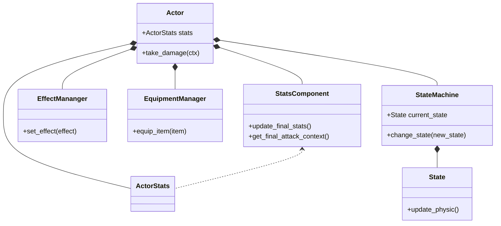

# 진행 사항
 지속적으로 리펙토링과 구조를 수정하고 있습니다. 그래서 안그래도 부족한 그래픽 쪽은 생각도 못하고 있습니다.

 캐릭터가 움직이고 효과를 받는 등의 동작 및 여러 컴포넌트들을 관리하는 부분을 중심적으로 보고 있습니다.
 State 패턴을 중심으로 동작을 결정하고 장비, 효과, 능력치를 관리하는 Manager클래스를 작성하고 각 역활을 분리해서 최대한
 의존성을 줄이고 응집도를 높이는 코드가 되도록 작성하고 있습니다.

## 캐릭터(Actor)의 구조와 클래스 다이어그램

 공격, 이동등 동작을 하고 상호작용 하는 기초가 되는 클래스 입니다. 이전 동작만 하도록 하다가 확장성이나 여러 기능?등을 고려하니 다시 고치고 일반적으로 사용하는 패턴들을 물어보고 적용했습니다.

 Actor 클래스가 각 역활에 필요한 관리자 클래스를 두고 처리하게 하는 많이 접하는 "의존성을 줄이고 응집도를 높인다"라는 코드가 되도록 구성해보고 있습니다. 각 관리자 클래스들은 되도록 서로를 모르는 상태가 되도록 구성되어 있는걸 볼 수 있습니다. 

## 리뷰

 코드를 다 작성하고 포스팅을 하자니 너무 진행이 느리고 다 잊어버려서 되도록 단위를 작게 끊어서 포스팅으로 복습도 하고 정리를 해나가는게 좋을것 같습니다. 클래스 다이어그램도 작성하는게 상당히 오래걸리네용. 